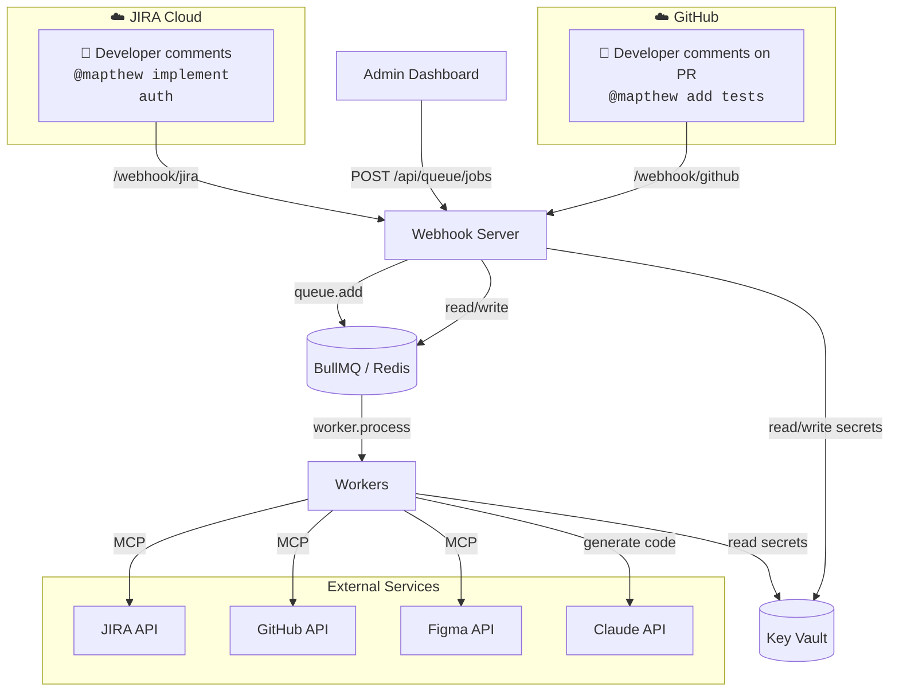
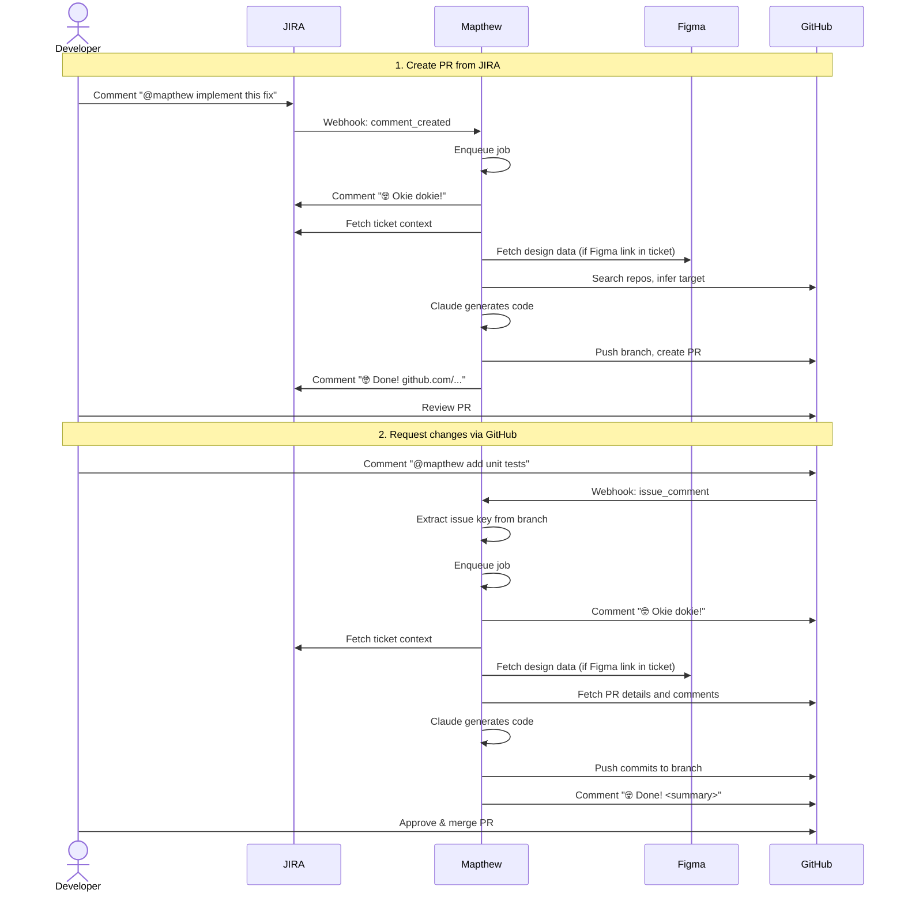
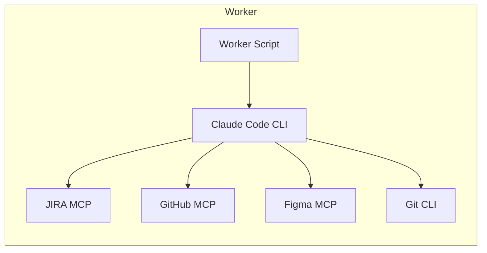
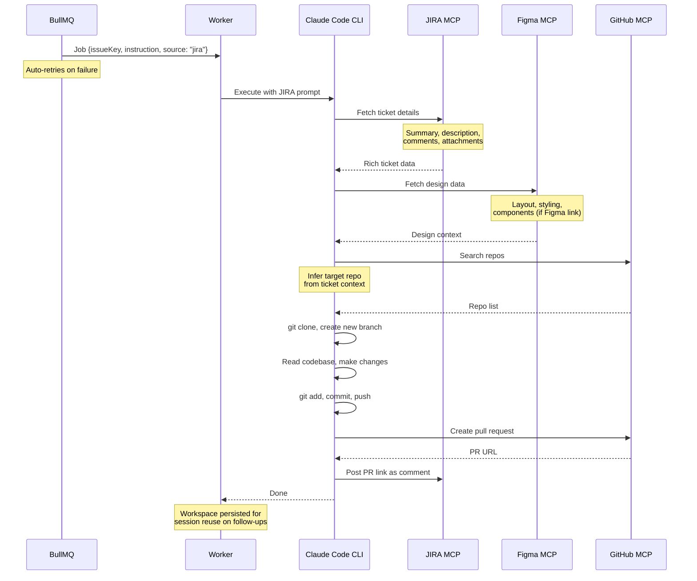
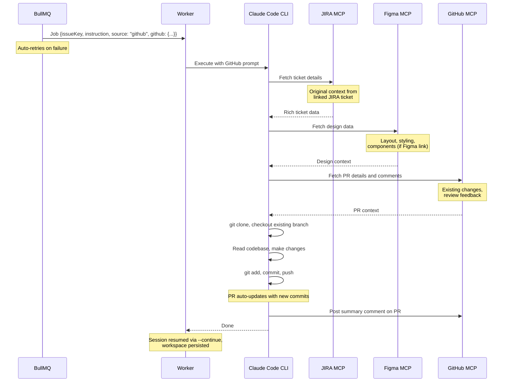
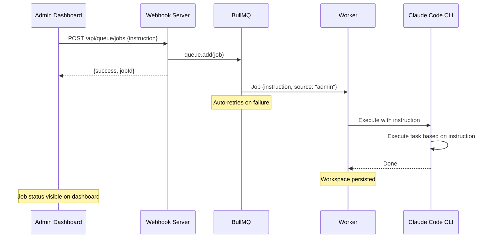
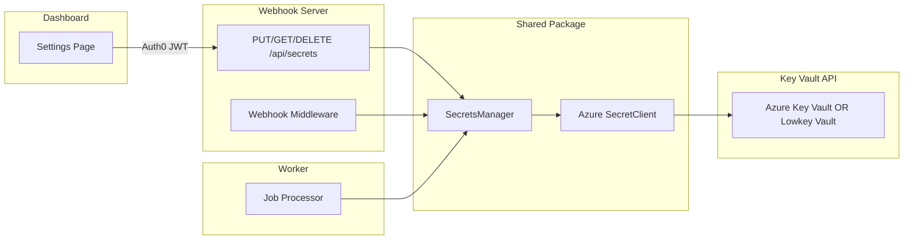
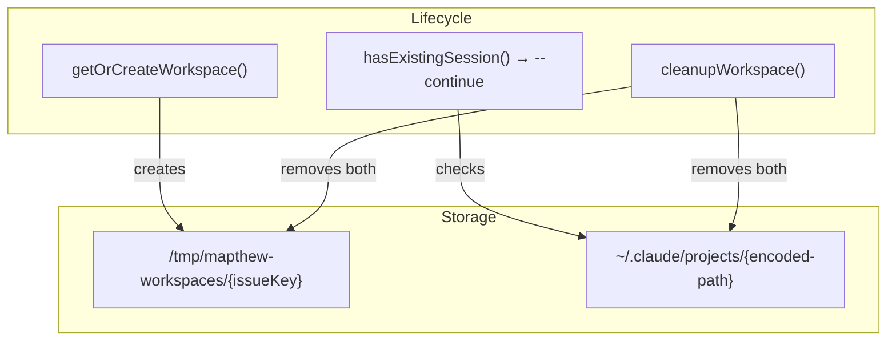
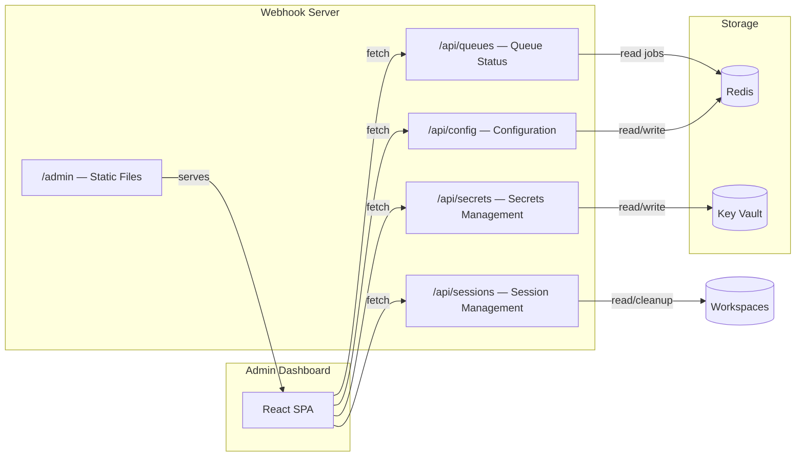

# Architecture

## Overview

### Workflow

Mapthew can be triggered from three entry points:

- **JIRA**: Comment `@mapthew` on a ticket to create a new PR
- **GitHub**: Comment `@mapthew` on an existing PR to request updates
- **Admin Dashboard**: Create a job manually with custom instructions

### End-to-End Example

## Worker Internals

- **Worker Script** — BullMQ worker, processes jobs with retries
- **Claude Code CLI** — AI agent that orchestrates the entire flow
- **JIRA MCP** — Fetches rich ticket context (description, comments, attachments, linked issues)
- **GitHub MCP** — Searches repos, creates PRs, posts comments
- **Figma MCP** — Fetches design data (layout, styling, components) from Figma files
- **Git CLI** — Clone, branch, commit, push (used by Claude)

---

### JIRA-Triggered Job (New PR)

### GitHub-Triggered Job (Update PR)

### Admin-Triggered Job (Manual)

Admin jobs are created directly from the dashboard without external triggers. They don't post completion comments since the status is visible on the dashboard.

---

## Required Credentials

| Credential                | Purpose                            | Scope                        |
| ------------------------- | ---------------------------------- | ---------------------------- |
| **JIRA API Token**        | JIRA MCP (fetch tickets, comments) | Read tickets, write comments |
| **JIRA Webhook Secret**   | Verify JIRA webhook signatures     | Optional (for security)      |
| **GitHub PAT**            | GitHub MCP + Git CLI               | `repo`, `workflow` scopes    |
| **GitHub Webhook Secret** | Verify GitHub webhook signatures   | Optional (for security)      |
| **Figma API Key**         | Figma MCP (fetch design data)      | Read-only access             |
| **Anthropic API Key**     | Claude Code CLI access             | Enterprise tier recommended  |

> All integration secrets above are stored in **Key Vault** and managed via the dashboard. See [Secrets Management](#secrets-management) below.
> On first startup, secrets can be seeded from env vars into Key Vault; after that, the vault is the single source of truth.

---

## Secrets Management

Integration secrets (JIRA, GitHub, Figma, Anthropic) are stored in a Key Vault and managed from the admin dashboard. The application uses the Azure Key Vault REST API as a universal interface -- the same `@azure/keyvault-secrets` client code works in all environments:

- **Production:** Azure Key Vault (encrypted at rest, RBAC, audit logs) with managed identity
- **Local dev:** [Lowkey Vault](https://github.com/nagyesta/lowkey-vault) -- an open-source Azure Key Vault API-compatible emulator running as a Docker container

### Architecture

`SecretsManager` (in `@mapthew/shared`) wraps `SecretClient` with a custom `VaultCredential` that authenticates via the managed identity token endpoint. Auth uses three env vars, same names in all environments:

### Environment Variables

| Variable                  | Purpose                         |
| ------------------------- | ------------------------------- |
| `AZURE_KEYVAULT_URL`      | Vault URL (required)            |
| `AZURE_IDENTITY_ENDPOINT` | Managed identity token endpoint |
| `AZURE_IDENTITY_HEADER`   | Managed identity auth header    |

### Stored Secrets

| Vault Key               | Seeded From (.env)      |
| ----------------------- | ----------------------- |
| `jira-email`            | `JIRA_EMAIL`            |
| `jira-api-token`        | `JIRA_API_TOKEN`        |
| `jira-webhook-secret`   | `JIRA_WEBHOOK_SECRET`   |
| `github-token`          | `GITHUB_TOKEN`          |
| `github-webhook-secret` | `GITHUB_WEBHOOK_SECRET` |
| `figma-api-key`         | `FIGMA_API_KEY`         |
| `anthropic-api-key`     | `ANTHROPIC_API_KEY`     |

### Startup Seed Flow

On first startup, for each managed secret: if the vault entry is empty and the corresponding env var is set, the env var value is written into the vault. After seeding, env vars are ignored -- the vault is the only source of truth.

### Read/Write Modes

- **Webhook server:** `readOnly: false` -- reads, writes, deletes, and runs seed logic
- **Worker:** `readOnly: true` -- read-only access, no seeding, no writes

### Local Dev

Lowkey Vault runs as a Docker Compose service alongside Redis. It serves HTTPS on port 8443 (vault API) and HTTP on port 8080 (token endpoint). `NODE_TLS_REJECT_UNAUTHORIZED=0` is set on webhook/worker containers for the self-signed cert.

> See [`docs/key-vault-secrets.md`](./key-vault-secrets.md) for full implementation details.

---

## Session Management

The worker uses **persistent workspaces** to reuse Claude CLI sessions across jobs for the same issue. This avoids redundant context fetching (JIRA tickets, codebases) on follow-up jobs.

### Key Concepts

- **Workspace**: A directory at `WORKSPACES_DIR/{issueKey}` used as the working directory for Claude CLI. Persists across jobs.
- **Claude session**: Claude CLI stores conversation history in `~/.claude/projects/{encoded-path}`. The `--continue` flag resumes the most recent conversation.
- **Session counting**: Only workspaces with a matching Claude session directory count toward `MAX_SESSIONS`.
- **Periodic pruning**: A background `setInterval` in the worker removes sessions inactive longer than `PRUNE_THRESHOLD_DAYS`. Runs every `PRUNE_INTERVAL_DAYS`.
- **Soft cap (LRU eviction)**: When creating a new workspace and the session count >= `MAX_SESSIONS`, the oldest session is evicted to make room.
- **Manual cleanup**: Sessions can be deleted via the dashboard API (`DELETE /api/sessions/:issueKey`), which calls `cleanupWorkspace()` directly.

### Environment Variables

| Variable               | Purpose                                         | Default                     |
| ---------------------- | ----------------------------------------------- | --------------------------- |
| `WORKSPACES_DIR`       | Root directory for workspaces                   | `/tmp/{botName}-workspaces` |
| `MAX_SESSIONS`         | Soft cap — oldest session evicted when exceeded | `5`                         |
| `PRUNE_THRESHOLD_DAYS` | Sessions inactive longer than this are pruned   | `7`                         |
| `PRUNE_INTERVAL_DAYS`  | How often the pruning job runs                  | `7` (weekly)                |

### Docker Volumes

| Volume               | Mount Point               | Purpose                 |
| -------------------- | ------------------------- | ----------------------- |
| `mapthew-workspaces` | `/tmp/mapthew-workspaces` | Workspace directories   |
| `claude-sessions`    | `/home/worker/.claude`    | Claude CLI session data |

---

## Admin Dashboard

The webhook server serves a custom React dashboard at `/admin` for monitoring and configuration.

**URL:** `http://localhost:3000/admin`

See [`packages/dashboard/AGENTS.md`](../packages/dashboard/AGENTS.md) for detailed specs.

---
