# Architecture

## Overview

### Workflow

Mapthew can be triggered from three entry points:

- **JIRA**: Comment `@mapthew` on a ticket to create a new PR
- **GitHub**: Comment `@mapthew` on an existing PR to request updates
- **Admin Dashboard**: Create a job manually with custom instructions

```mermaid
flowchart TD
    subgraph JIRA["☁️ JIRA Cloud"]
        A[👤 Developer comments<br/><code>@mapthew implement auth</code>]
    end

    subgraph GitHub["☁️ GitHub"]
        G[👤 Developer comments on PR<br/><code>@mapthew add tests</code>]
    end

    B[Webhook Server]
    ADMIN[Admin Dashboard]

    C[("BullMQ / Redis")]
    D[Workers]

    subgraph External["External Services"]
        H[GitHub API]
        I[Claude API]
        J[JIRA API]
        K[Figma API]
    end

    A -->|/webhook/jira| B
    G -->|/webhook/github| B
    ADMIN -->|POST /api/queue/jobs| B
    B -->|queue.add| C
    C -->|worker.process| D
    D -->|MCP| J
    D -->|MCP| H
    D -->|MCP| K
    D -->|generate code| I

    B -->|read/write| C
```

### End-to-End Example

```mermaid
sequenceDiagram
    actor Dev as Developer
    participant JIRA
    participant System as Mapthew
    participant Figma
    participant GH as GitHub

    Note over Dev,GH: 1. Create PR from JIRA

    Dev->>JIRA: Comment "@mapthew implement this fix"
    JIRA->>System: Webhook: comment_created
    System->>System: Enqueue job
    System->>JIRA: Comment "🤓 Okie dokie!"

    System->>JIRA: Fetch ticket context
    System->>Figma: Fetch design data (if Figma link in ticket)
    System->>GH: Search repos, infer target
    System->>System: Claude generates code
    System->>GH: Push branch, create PR
    System->>JIRA: Comment "🤓 Done! github.com/..."

    Dev->>GH: Review PR

    Note over Dev,GH: 2. Request changes via GitHub

    Dev->>GH: Comment "@mapthew add unit tests"
    GH->>System: Webhook: issue_comment
    System->>System: Extract issue key from branch
    System->>System: Enqueue job
    System->>GH: Comment "🤓 Okie dokie!"

    System->>JIRA: Fetch ticket context
    System->>Figma: Fetch design data (if Figma link in ticket)
    System->>GH: Fetch PR details and comments
    System->>System: Claude generates code
    System->>GH: Push commits to branch
    System->>GH: Comment "🤓 Done! <summary>"

    Dev->>GH: Approve & merge PR
```

## Worker Internals

- **Worker Script** — BullMQ worker, processes jobs with retries
- **Claude Code CLI** — AI agent that orchestrates the entire flow
- **JIRA MCP** — Fetches rich ticket context (description, comments, attachments, linked issues)
- **GitHub MCP** — Searches repos, creates PRs, posts comments
- **Figma MCP** — Fetches design data (layout, styling, components) from Figma files
- **Git CLI** — Clone, branch, commit, push (used by Claude)

---

### JIRA-Triggered Job (New PR)

### GitHub-Triggered Job (Update PR)

### Admin-Triggered Job (Manual)

Admin jobs are created directly from the dashboard without external triggers. They don't post completion comments since the status is visible on the dashboard.

---

## Required Credentials

| Credential                | Purpose                            | Scope                        |
| ------------------------- | ---------------------------------- | ---------------------------- |
| **JIRA API Token**        | JIRA MCP (fetch tickets, comments) | Read tickets, write comments |
| **JIRA Webhook Secret**   | Verify JIRA webhook signatures     | Optional (for security)      |
| **GitHub PAT**            | GitHub MCP + Git CLI               | `repo`, `workflow` scopes    |
| **GitHub Webhook Secret** | Verify GitHub webhook signatures   | Optional (for security)      |
| **Figma API Key**         | Figma MCP (fetch design data)      | Read-only access             |
| **Anthropic API Key**     | Claude Code CLI access             | Enterprise tier recommended  |

> MCP servers and Git CLI authenticate via environment variables (`JIRA_API_TOKEN`, `GITHUB_TOKEN`, `FIGMA_API_KEY`).
> Webhook secrets are optional but recommended for production deployments.

---

## Admin Dashboard

The webhook server serves a custom React dashboard at `/admin` for monitoring and configuration.

**URL:** `http://localhost:3000/admin`

```mermaid
flowchart LR
    subgraph Dashboard["Admin Dashboard"]
        UI["React SPA"]
    end

    subgraph Server["Webhook Server"]
        STATIC["/admin — Static Files"]
        API_Q["/api/queues — Queue Status"]
        API_C["/api/config — Configuration"]
    end

    subgraph Storage
        REDIS[("Redis")]
    end

    UI -->|fetch| API_Q
    UI -->|fetch| API_C
    API_Q -->|read jobs| REDIS
    API_C -->|read/write| REDIS
    STATIC -->|serves| UI
```

See [`packages/dashboard/AGENTS.md`](../packages/dashboard/AGENTS.md) for detailed specs.

---
