# Architecture

## Overview

### Workflow

```mermaid
flowchart TD
    subgraph JIRA["☁️ JIRA Cloud"]
        A[👤 Developer comments<br/><code>@dexter implement auth</code>]
    end

    B[Webhook Server]
    C[("BullMQ / Redis")]
    D[Workers]

    subgraph External["🔗 External Services"]
        H[GitHub]
        I[Claude API]
        J[JIRA API]
    end

    A -->|webhook| B
    B -->|queue.add| C
    C -->|worker.process| D
    D -->|MCP| J
    D -->|MCP| H
    D -->|generate code| I
```

### End-to-End Example

```mermaid
sequenceDiagram
    actor Dev as Developer
    participant JIRA
    participant System as Dexter
    participant GH as GitHub

    Dev->>JIRA: Comment "@dexter implement this fix"
    JIRA->>System: Webhook: comment_created
    System->>System: Enqueue job
    System->>JIRA: Comment "🤓 Okie dokie!"

    Note over System: Worker picks up job

    System->>JIRA: Fetch ticket context
    System->>GH: Search repos, infer target
    System->>GH: Clone repo
    System->>System: Claude generates code
    System->>GH: Push branch, create PR
    System->>JIRA: Comment "🤓 Done! github.com/..."

    Dev->>GH: Review & merge PR
```

## Worker Internals

- **Worker Script** — BullMQ worker, processes jobs with retries
- **Claude Code CLI** — AI agent that orchestrates the entire flow
- **JIRA MCP** — Fetches rich ticket context (description, comments, attachments, linked issues)
- **GitHub MCP** — Searches repos, creates PRs, posts comments
- **Git CLI** — Clone, branch, commit, push (used by Claude)

---

---

## Required Credentials

| Credential            | Purpose                            | Scope                        |
| --------------------- | ---------------------------------- | ---------------------------- |
| **JIRA API Token**    | JIRA MCP (fetch tickets, comments) | Read tickets, write comments |
| **GitHub PAT**        | GitHub MCP + Git CLI               | `repo`, `workflow` scopes    |
| **Anthropic API Key** | Claude Code CLI access             | Enterprise tier recommended  |

> Both MCP servers and Git CLI authenticate via environment variables (`JIRA_API_TOKEN`, `GITHUB_TOKEN`).

---

## Admin Dashboard

The webhook server exposes a [Bull Board](https://github.com/felixmosh/bull-board) dashboard at `/admin` for monitoring the job queue.

**URL:** `http://localhost:3000/admin`

**Features:**

- View jobs by status (waiting, active, completed, failed, delayed)
- Inspect job data and error messages
- Retry or remove failed jobs
- Queue statistics

---
