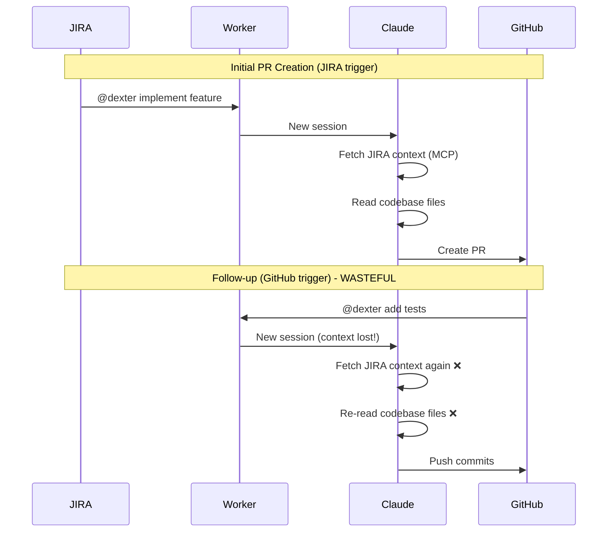

# Context Caching Research

> Research document exploring options for sharing/reusing context between JIRA-triggered and GitHub-triggered workflows to reduce redundant API calls and costs.

## Problem Statement

Currently, when a GitHub comment triggers a follow-up job on a PR that was created from a JIRA ticket:

1. Worker spawns a new Claude Code CLI process
2. Claude fetches the same JIRA ticket context via MCP (already fetched during PR creation)
3. Claude re-reads codebase files it already analyzed
4. This is wasteful in both API tokens and latency

### Workflow Diagram



---

## Approaches Evaluated

### Approach A: Claude Code Session Resume (`--resume`)

**How it works:**

- Claude Code CLI stores sessions in `.claude/` directory
- Sessions can be resumed via `--resume <session_id>` or `--continue`

**Implementation:**

```bash
# First job - captures session ID
claude --print "implement feature" --mcp-config config.json
# Session stored in .claude/

# Follow-up job - resume session
claude --resume <session_id> "add tests"
```

**Why it won't work well:**

- Current architecture uses temp workspaces cleaned up after each job
- Session data in temp dir gets deleted
- Would require persistent workspaces or external session storage
- Sessions can grow large and include outdated context

---

### Approach B: Redis Cache (JIRA Context Only)

**How it works:**

- Pre-fetch JIRA context when processing a job
- Store structured context in Redis keyed by issue key
- For GitHub jobs, inject cached context into prompt

**Implementation:**

```typescript
interface CachedContext {
  issueKey: string;
  summary: string;
  description: string;
  comments: string[];
  fetchedAt: number;
}

// Cache key: context:DXTR-123
await redis.set(`context:${issueKey}`, JSON.stringify(context), "EX", 86400);
```

**Pros:**

- Simple implementation
- Persistent storage beyond API cache TTLs
- Keeps Claude Code CLI architecture

**Cons:**

- Only caches JIRA context (~5% of token cost for large repos)
- Doesn't help with codebase context

---

### Approach C: Direct Anthropic SDK with Prompt Caching

**How it works:**

- Replace Claude Code CLI with direct Anthropic SDK calls
- Use `cache_control` markers on static content
- Cache hits cost 0.1x base input token price

**Implementation:**

```typescript
const response = await client.messages.create({
  model: "claude-sonnet-4-5",
  system: [
    {
      type: "text",
      text: systemPrompt,
      cache_control: { type: "ephemeral", ttl: "1h" },
    },
  ],
  messages: [
    {
      role: "user",
      content: [
        {
          type: "text",
          text: jiraContext,
          cache_control: { type: "ephemeral", ttl: "1h" },
        },
      ],
    },
  ],
});
```

**Why not recommended:**

- Major architectural change (~500+ lines to reimplement)
- API cache max TTL is 1 hour (reviews often come later)
- Must reimplement MCP tool calling, streaming, agent loop
- Uncertain ROI if cache hit rate is low

**When it becomes viable:**

- If Anthropic extends cache TTL beyond 1hr
- As Phase 2 after simpler approach proves concept

---

### Approach D: Persistent Workspaces

**How it works:**

- Use persistent workspaces keyed by issue (e.g., `/workspaces/DXTR-123/`)
- Claude Code stores sessions in `.claude/` within each workspace
- For GitHub follow-ups, resume the existing session

**Implementation:**

```typescript
// Instead of temp directory
const workDir = `/workspaces/${issueKey}`;
await fs.mkdir(workDir, { recursive: true });

// Clone only if not exists
if (!(await fs.exists(path.join(workDir, ".git")))) {
  await git.clone(repoUrl, workDir, { depth: 1 });
}

// Resume session
const args = ["--continue", "--print", prompt];
spawn("claude", args, { cwd: workDir });
```

**Pros:**

- Full context preserved (JIRA + codebase understanding)
- Native Claude Code feature
- Best potential savings for large repos

**Cons:**

- High disk usage (~3.5 GB per workspace for large monorepos)
- Needs cleanup strategy
- Workspace locking for concurrent access

---

### Approach E: Pre-fetch in Job Payload

**How it works:**

- Fetch JIRA context at webhook time
- Include context in BullMQ job data
- Worker receives job with context already attached

**Implementation:**

```typescript
// In webhook handler
const jiraContext = await fetchJiraTicket(issueKey);
await queue.add({
  ...jobData,
  prefetchedContext: jiraContext,
});
```

**Pros:**

- No separate caching layer
- Context guaranteed fresh at job creation
- Simple architecture

**Cons:**

- Same limitation as Option B (JIRA only)
- Increases Redis memory for job queue

---

### Approach F: MCP-Level Response Caching

**How it works:**

- Modify or wrap JIRA MCP server to cache responses
- First call fetches and caches, subsequent calls return cached

**Pros:**

- Transparent to Claude and worker
- Could benefit other MCP consumers

**Cons:**

- Requires MCP server modification
- External packages harder to modify
- Cache invalidation complexity

---

### Approach G: External Session Storage (S3)

**How it works:**

- After job completion, archive `.claude/` directory to S3
- Before GitHub job starts, restore session from S3
- Use `--resume` to continue

**Implementation:**

```typescript
// After JIRA job completes
await archiveToS3(path.join(workDir, ".claude"), `sessions/${issueKey}.tar.gz`);

// Before GitHub job starts
await restoreFromS3(
  `sessions/${issueKey}.tar.gz`,
  path.join(workDir, ".claude"),
);

spawn("claude", ["--resume", sessionId, prompt], { cwd: workDir });
```

**Pros:**

- Full session context preserved
- Cheapest storage at scale ($0.023/GB)
- Indefinite retention

**Cons:**

- Implementation complexity
- Download latency (~5-10s for 150MB)
- Session format compatibility across Claude versions

---

### Approach H: Hybrid (Pre-fetch + Redis Cache)

**How it works:**

- Combine Options B and E
- Job payload has JIRA context
- Redis serves as backup cache

**Pros:**

- Fast path for immediate follow-ups
- Persistent for delayed follow-ups

**Cons:**

- Two mechanisms to maintain
- Same limitation (JIRA context only)

---

## Storage Estimates

### Per-Option Storage Requirements

| Option                   | Per-Item Size | 100 Items | Storage Type |
| ------------------------ | ------------- | --------- | ------------ |
| B: Redis Cache           | 7-25 KB       | 2.5 MB    | Redis        |
| D: Persistent Workspaces | 3.0-3.5 GB\*  | 350 GB    | Disk         |
| E: Pre-fetch Job         | 7-25 KB       | 2.5 MB    | Redis (temp) |
| G: Session Storage       | 50-150 MB     | 15 GB     | S3           |
| H: Hybrid                | 15-50 KB      | 5 MB      | Redis        |

\*Based on MappedIn/self-serve benchmark (3.1 GB repo)

### Storage Costs

| Storage Type         | Cost/GB/month | 100 GB Cost |
| -------------------- | ------------- | ----------- |
| Redis (ElastiCache)  | ~$50          | $5,000      |
| EBS gp3 (Disk)       | $0.08         | $8          |
| S3 Standard          | $0.023        | $2.30       |
| S3 Infrequent Access | $0.0125       | $1.25       |

---

## Benchmark: MappedIn/self-serve

### Repository Profile

| Metric                         | Value               |
| ------------------------------ | ------------------- |
| **Total Size**                 | 3.1 GB              |
| **Git History**                | 220 MB              |
| **node_modules**               | 1.9 GB              |
| **Source Code** (without deps) | ~1.0 GB             |
| **Source Files**               | 42,751              |
| **Git Commits**                | 4,512               |
| **Tech Stack**                 | TypeScript Monorepo |

### Package Breakdown

| Package     | Size   |
| ----------- | ------ |
| client      | 339 MB |
| 3d-editor   | 128 MB |
| api-service | 122 MB |
| lib         | 53 MB  |
| path-viewer | 45 MB  |
| icons       | 35 MB  |

### Token Analysis

For a task on this repo, Claude typically processes:

| Context Type   | Size   | Tokens  | Cost (Sonnet) | % of Total |
| -------------- | ------ | ------- | ------------- | ---------- |
| JIRA ticket    | 25 KB  | 6,250   | $0.019        | 4.8%       |
| Codebase reads | 500 KB | 125,000 | $0.375        | 95.2%      |
| **Total**      | 525 KB | 131,250 | $0.394        | 100%       |

**Key insight:** For large repos, JIRA context is only ~5% of token cost. The main cost is Claude reading codebase files.

---

## Cost Analysis

### Monthly Costs: 100 tickets, 3 follow-ups each

| Option           | Storage Cost | API Cost | Total Cost | Net Savings |
| ---------------- | ------------ | -------- | ---------- | ----------- |
| No caching       | $0           | $157.20  | $157.20    | $0          |
| B: Redis (JIRA)  | $12          | $151.50  | $163.50    | -$6.30      |
| D: Persistent WS | $28          | $66.00   | $94.00     | **+$63.20** |
| E: Pre-fetch     | $12          | $151.50  | $163.50    | -$6.30      |
| G: Session S3    | $5           | $66.00   | $71.00     | **+$86.20** |
| H: Hybrid        | $12          | $148.00  | $160.00    | -$2.80      |

### Break-even Analysis

**Option D (Persistent Workspaces):**

```
Storage: $28/month (350 GB EBS)
Savings: $91.20/month (API reduction)
Net: +$63.20/month
Break-even: ~31 tickets with follow-ups
```

**Option G (Session S3):**

```
Storage: $5/month (15 GB S3 + transfer)
Savings: $91.20/month (API reduction)
Net: +$86.20/month
Break-even: ~6 tickets with follow-ups
```

### At Scale: 1000 tickets/month

| Option           | Storage | Savings | ROI  |
| ---------------- | ------- | ------- | ---- |
| D: Persistent WS | $280    | $912    | 3.3x |
| G: Session S3    | $50     | $912    | 18x  |

---

## Monitoring & Observability

### Metrics to Track

```typescript
interface CacheMetrics {
  // Hit/miss tracking
  hits: number;
  misses: number;
  hitRate: number;

  // Storage
  itemCount: number;
  totalSizeBytes: number;
  avgItemSizeBytes: number;

  // Timing
  avgReadLatencyMs: number;
  avgWriteLatencyMs: number;

  // Cost tracking
  estimatedTokensSaved: number;
  estimatedCostSaved: number;
}
```

### Logging Format

```json
{
  "level": "info",
  "event": "cache_operation",
  "type": "hit",
  "key": "DXTR-123",
  "sizeBytes": 15234,
  "durationMs": 2.5,
  "ageSeconds": 3600,
  "timestamp": "2026-01-29T10:30:00Z"
}
```

### Health Endpoint

```
GET /metrics/cache
{
  "cache": {
    "hits": 1234,
    "misses": 56,
    "hitRate": 0.956,
    "itemCount": 89,
    "totalSizeBytes": 2234567
  },
  "costs": {
    "estimatedTokensSaved": 12500000,
    "estimatedCostSaved": 37.50
  }
}
```

### Alert Thresholds

| Metric                | Warning  | Critical |
| --------------------- | -------- | -------- |
| Cache hit rate        | < 50%    | < 25%    |
| Cache size (Redis)    | > 500 MB | > 1 GB   |
| Disk usage (Option D) | > 500 GB | > 1 TB   |
| Read latency P99      | > 100ms  | > 500ms  |

---

## Recommendations

### For Large Monorepos (like self-serve)

1. **Best ROI: Option G (Session Storage in S3)**
   - Lowest storage cost ($5/month)
   - Highest savings ($86/month net)
   - Preserves full session context

2. **Best simplicity: Option D (Persistent Workspaces)**
   - Easy to implement
   - Good savings ($63/month net)
   - Needs disk cleanup strategy

3. **Not recommended: Options B/E/H**
   - Only cache JIRA context (5% of cost)
   - Storage cost may exceed savings

### For Small Repos (<100 MB)

Options B/E/H become viable because:

- JIRA context is larger % of total tokens
- Simpler implementation
- Lower storage requirements

### Implementation Priority

1. **Phase 1:** Option D (Persistent Workspaces)
   - Fastest to implement
   - Validates the concept
   - Acceptable for moderate scale

2. **Phase 2:** Option G (Session S3)
   - Better cost efficiency
   - Implement after Phase 1 proves value
   - More complex (archive/restore logic)

3. **Phase 3:** Consider Anthropic API caching
   - If/when TTL extends beyond 1hr
   - Can combine with session storage

---

## Appendix A: Claude API Pricing Reference

### Claude Models (as of Jan 2026)

| Model      | Input   | Output   | Cache Write (5m) | Cache Write (1h) | Cache Read |
| ---------- | ------- | -------- | ---------------- | ---------------- | ---------- |
| Sonnet 4.5 | $3/MTok | $15/MTok | $3.75/MTok       | $6/MTok          | $0.30/MTok |
| Opus 4.5   | $5/MTok | $25/MTok | $6.25/MTok       | $10/MTok         | $0.50/MTok |
| Haiku 4.5  | $1/MTok | $5/MTok  | $1.25/MTok       | $2/MTok          | $0.10/MTok |

**Source:** [Anthropic Pricing](https://www.anthropic.com/pricing)

### Token Estimation

- ~4 characters = 1 token
- Average TypeScript file: 200-500 lines = 1,000-3,000 tokens
- JIRA ticket (medium): ~6,000 tokens
- Large monorepo context: 50,000-200,000 tokens

---

## Appendix B: Storage Pricing Reference

### AWS S3 (Object Storage) - US East Region

| Storage Class          | Storage Cost  | PUT/POST  | GET        | Data Transfer Out |
| ---------------------- | ------------- | --------- | ---------- | ----------------- |
| S3 Standard            | $0.023/GB/mo  | $0.005/1K | $0.0004/1K | $0.09/GB          |
| S3 Intelligent-Tiering | $0.023/GB/mo  | $0.005/1K | $0.0004/1K | $0.09/GB          |
| S3 Standard-IA         | $0.0125/GB/mo | $0.01/1K  | $0.001/1K  | $0.09/GB          |
| S3 Glacier Instant     | $0.004/GB/mo  | $0.02/1K  | $0.01/1K   | $0.09/GB          |

**Example costs for session storage:**

- 100 sessions × 150 MB = 15 GB
- Storage: 15 GB × $0.023 = $0.35/month
- Uploads: 100 × $0.005/1K = $0.0005/month
- Downloads (300 restores): 300 × 150MB × $0.09/GB = $4.05/month
- **Total: ~$4.40/month**

**Source:** [AWS S3 Pricing](https://aws.amazon.com/s3/pricing/)

---

### AWS EBS (Block Storage) - US East Region

| Volume Type               | Storage Cost | IOPS        | Throughput    |
| ------------------------- | ------------ | ----------- | ------------- |
| gp3 (General Purpose SSD) | $0.08/GB/mo  | 3,000 free  | 125 MB/s free |
| gp2 (General Purpose SSD) | $0.10/GB/mo  | 3 IOPS/GB   | Burst         |
| io2 (Provisioned IOPS)    | $0.125/GB/mo | $0.065/IOPS | -             |
| st1 (Throughput HDD)      | $0.045/GB/mo | -           | 40 MB/s base  |
| sc1 (Cold HDD)            | $0.015/GB/mo | -           | 12 MB/s base  |

**Example costs for persistent workspaces:**

- 100 workspaces × 3.5 GB = 350 GB
- gp3: 350 GB × $0.08 = $28/month
- st1 (if IOPS not needed): 350 GB × $0.045 = $15.75/month

**Source:** [AWS EBS Pricing](https://aws.amazon.com/ebs/pricing/)

---

### AWS ElastiCache for Redis

| Node Type       | vCPU | Memory   | On-Demand ($/hr) | Monthly (730 hrs) |
| --------------- | ---- | -------- | ---------------- | ----------------- |
| cache.t3.micro  | 2    | 0.5 GB   | $0.017           | $12.41            |
| cache.t3.small  | 2    | 1.37 GB  | $0.034           | $24.82            |
| cache.t3.medium | 2    | 3.09 GB  | $0.068           | $49.64            |
| cache.m6g.large | 2    | 6.38 GB  | $0.124           | $90.52            |
| cache.r6g.large | 2    | 13.07 GB | $0.182           | $132.86           |

**Serverless option:**

- $0.0034/ECU-hour (compute)
- $0.125/GB/month (storage)
- Minimum ~$6/month

**Example costs for JIRA context cache:**

- 1,000 tickets × 25 KB = 25 MB
- cache.t3.micro (0.5 GB): $12.41/month ✓
- With headroom for job queue: cache.t3.small: $24.82/month

**Source:** [AWS ElastiCache Pricing](https://aws.amazon.com/elasticache/pricing/)

---

### Redis Cloud (Managed Redis)

| Plan         | Memory | Price/month | Features          |
| ------------ | ------ | ----------- | ----------------- |
| Free         | 30 MB  | $0          | 1 database, no HA |
| Fixed 250 MB | 250 MB | $5          | 1 database, no HA |
| Fixed 500 MB | 500 MB | $10         | 1 database, no HA |
| Fixed 1 GB   | 1 GB   | $21         | 1 database, no HA |
| Pro (starts) | 1 GB+  | ~$65+       | HA, multi-zone    |

**Example costs:**

- Development/testing: Free tier (30 MB)
- Small production: Fixed 250 MB ($5/month)
- Medium production: Fixed 1 GB ($21/month)

**Source:** [Redis Cloud Pricing](https://redis.com/redis-enterprise-cloud/pricing/)

---

### Upstash (Serverless Redis)

| Tier          | Commands/day | Storage | Price              |
| ------------- | ------------ | ------- | ------------------ |
| Free          | 10K          | 256 MB  | $0                 |
| Pay-as-you-go | Unlimited    | 1 GB    | $0.2/100K commands |
| Pro 2K        | 2K/sec       | 10 GB   | $280/month         |

**Example costs (pay-as-you-go):**

- 10,000 cache operations/month = $0.02
- 1 GB storage = included
- **Total: ~$1-5/month for light usage**

**Source:** [Upstash Pricing](https://upstash.com/pricing)

---

### DigitalOcean (Alternative Cloud)

| Service                | Size                   | Price/month |
| ---------------------- | ---------------------- | ----------- |
| Managed Redis          | 1 GB                   | $15         |
| Managed Redis          | 2 GB                   | $30         |
| Block Storage          | per GB                 | $0.10       |
| Spaces (S3-compatible) | 250 GB + 1 TB transfer | $5          |

**Example costs:**

- Redis cache: $15/month (1 GB)
- Session storage (Spaces): $5/month (250 GB included)

**Source:** [DigitalOcean Pricing](https://www.digitalocean.com/pricing)

---

### Self-Hosted (Docker/Kubernetes)

| Component             | Resource          | Estimated Cost           |
| --------------------- | ----------------- | ------------------------ |
| Redis container       | 512 MB - 2 GB RAM | $0 (uses existing infra) |
| Local disk            | SSD storage       | $0 (uses existing infra) |
| S3-compatible (MinIO) | Self-hosted       | $0 (uses existing infra) |

**Considerations:**

- No additional cost if running on existing infrastructure
- Must account for server costs if scaling
- Operational overhead for maintenance

---

## Appendix C: Cost Comparison Summary

### Storage Cost per GB/month

| Provider     | Redis        | Block Storage  | Object Storage |
| ------------ | ------------ | -------------- | -------------- |
| AWS          | $24-200/GB\* | $0.08-0.125/GB | $0.023/GB      |
| DigitalOcean | $15/GB       | $0.10/GB       | $0.02/GB       |
| Redis Cloud  | $5-21/GB     | -              | -              |
| Upstash      | ~$0.20/GB    | -              | -              |
| Self-hosted  | $0\*\*       | $0\*\*         | $0\*\*         |

\*ElastiCache pricing is per-node, not per-GB
\*\*Assumes existing infrastructure

### Recommended Providers by Option

| Option                   | Recommended                 | Cost Estimate |
| ------------------------ | --------------------------- | ------------- |
| B: Redis Cache           | Upstash or Redis Cloud Free | $0-5/month    |
| D: Persistent Workspaces | AWS EBS gp3 or local disk   | $0-28/month   |
| G: Session S3            | AWS S3 or DO Spaces         | $5/month      |
| H: Hybrid                | Upstash + existing disk     | $5/month      |

---

## References

### Documentation

- [Claude Prompt Caching](https://platform.claude.com/docs/en/build-with-claude/prompt-caching)
- [Claude Code CLI Reference](https://docs.claude.com/en/docs/claude-code/cli-reference)
- [BullMQ Documentation](https://docs.bullmq.io/)

### Pricing Pages

- [Anthropic Pricing](https://www.anthropic.com/pricing)
- [AWS S3 Pricing](https://aws.amazon.com/s3/pricing/)
- [AWS EBS Pricing](https://aws.amazon.com/ebs/pricing/)
- [AWS ElastiCache Pricing](https://aws.amazon.com/elasticache/pricing/)
- [Redis Cloud Pricing](https://redis.com/redis-enterprise-cloud/pricing/)
- [Upstash Pricing](https://upstash.com/pricing)
- [DigitalOcean Pricing](https://www.digitalocean.com/pricing)

### Calculators

- [AWS Pricing Calculator](https://calculator.aws/)
- [Redis Cloud Sizing](https://redis.com/redis-enterprise-cloud/essentials-pricing/)

---

_Document created: January 29, 2026_
_Last updated: January 29, 2026_
