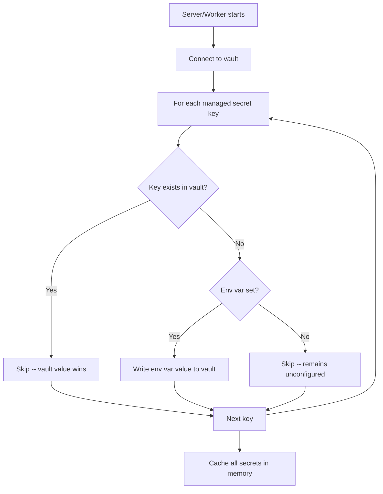
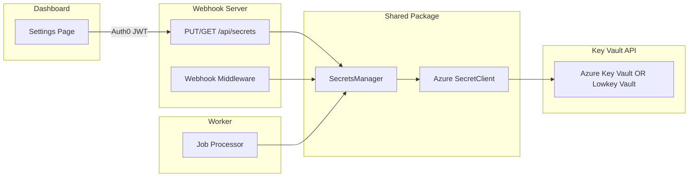

# Key Vault Secrets Management

## Context

Today, all integration secrets (JIRA, GitHub, Figma, Anthropic) are configured via `.env` and displayed read-only on the dashboard. The goal is to let admins configure these secrets from the dashboard, backed by a Key Vault API-compatible store as the **single source of truth**.

## Approach

Use the Azure Key Vault REST API / SDK as the universal interface. The backend differs by environment but the application code is identical:

- **Production:** Azure Key Vault (encrypted at rest, RBAC, audit logs) with a service principal
- **Local dev:** [Lowkey Vault](https://github.com/nagyesta/lowkey-vault) -- an open-source Azure Key Vault API-compatible emulator running as a Docker container. No Azure account needed. Each developer gets their own isolated instance via Docker Compose.

Both speak the same API, so `SecretClient` from `@azure/keyvault-secrets` works against either. The only env var that changes is `AZURE_KEYVAULT_URL`.

### Key design points

- **Key Vault is always required.** `AZURE_KEYVAULT_URL` is a mandatory env var. All secret reads and writes go through it.
- **Env vars are a one-time seed.** On startup, for each managed secret: if the vault entry is empty and the corresponding env var is set, write the env var value into the vault. Smooth migration -- existing `.env` secrets auto-populate the vault on first boot.
- **After seeding, env vars are ignored.** The vault is the only source of truth. Secrets are managed entirely from the dashboard.

### Auth: Custom `VaultCredential` using managed identity protocol

Instead of relying on `DefaultAzureCredential`'s env-var sniffing, we implement a small custom `TokenCredential` (~15 lines) that calls the managed identity token endpoint explicitly. Both Azure's real endpoint and Lowkey Vault's fake endpoint speak the same protocol.

Three env vars, all `AZURE_` prefixed, same names in all environments:

```
AZURE_KEYVAULT_URL=...
AZURE_IDENTITY_ENDPOINT=...
AZURE_IDENTITY_HEADER=...
```

- **Local `.env`:**

```
AZURE_KEYVAULT_URL=https://localhost:8443
AZURE_IDENTITY_ENDPOINT=http://localhost:8080/metadata/identity/oauth2/token
AZURE_IDENTITY_HEADER=dummy
```

Lowkey Vault provides a fake managed identity token endpoint at port 8080.

- **Production env config (Azure App Service / Container Apps):**

```
AZURE_KEYVAULT_URL=https://mapthew-kv.vault.azure.net
AZURE_IDENTITY_ENDPOINT=<real managed identity endpoint from Azure platform>
AZURE_IDENTITY_HEADER=<real identity header from Azure platform>
```

In Azure App Service / Container Apps, these values are available from the platform as `IDENTITY_ENDPOINT` and `IDENTITY_HEADER`. They can be mapped to our `AZURE_` prefixed names in the app's configuration.

**No `DefaultAzureCredential`, no `@azure/identity` dependency.** Just `@azure/keyvault-secrets` and our own `VaultCredential` class.

### TLS

Lowkey Vault serves HTTPS with a self-signed cert. Set `NODE_TLS_REJECT_UNAUTHORIZED=0` on the webhook and worker services in `docker-compose.yml`. This disables TLS verification for all outbound HTTPS in those containers -- acceptable for local dev. In production this var is not set; Azure Key Vault uses a publicly trusted cert.

### Startup Seed Flow



### What lives in the vault

- `jira-email` (seeded from `JIRA_EMAIL`)
- `jira-api-token` (seeded from `JIRA_API_TOKEN`)
- `jira-webhook-secret` (seeded from `JIRA_WEBHOOK_SECRET`)
- `github-token` (seeded from `GITHUB_TOKEN`)
- `github-webhook-secret` (seeded from `GITHUB_WEBHOOK_SECRET`)
- `figma-api-key` (seeded from `FIGMA_API_KEY`)
- `anthropic-api-key` (seeded from `ANTHROPIC_API_KEY`)

### What stays as env vars (infrastructure/bootstrap -- not secrets)

`PORT`, `REDIS_URL`, `AUTH0_DOMAIN`, `AUTH0_AUDIENCE`, `AUTH0_CLIENT_ID`

Plus the vault connection (same names in all environments):

- `AZURE_KEYVAULT_URL` (required) -- vault URL
- `AZURE_IDENTITY_ENDPOINT` (required) -- managed identity token endpoint
- `AZURE_IDENTITY_HEADER` (required) -- managed identity auth header

---

## Architecture



`SecretsManager` wraps Azure `SecretClient` with a custom `VaultCredential`. The client doesn't know or care whether it's talking to real Azure Key Vault or Lowkey Vault -- same REST API, same token protocol.

---

## Implementation

### 1. Shared: Secrets Manager (`@mapthew/shared`)

**New dependency:** `@azure/keyvault-secrets` (no `@azure/identity` needed -- we implement our own `TokenCredential`)

**New file: `packages/shared/src/secrets.ts`**

- `VaultCredential` class implementing `TokenCredential` from `@azure/core-auth`:
  - Constructor takes `endpoint: string` and `header: string`
  - `getToken(scopes)` calls the identity endpoint with `x-identity-header` and `resource` query param
  - **Token caching:** Caches the token in memory and reuses it until `expires_on` minus a 5-minute buffer. Only fetches a new token when the cached one is expired or absent.
  - **Response validation:** Verifies the response contains `access_token` and `expires_on` fields before returning. Throws a descriptive error if the identity endpoint returns unexpected data.
  - **Error handling:** Wraps the fetch in try/catch. On network failure or non-200 response, throws a clear error like `"Failed to obtain vault token from AZURE_IDENTITY_ENDPOINT: <status> <message>"`.
  - Returns `{ token, expiresOnTimestamp }`
  - ~30 lines, works against both Azure's real endpoint and Lowkey Vault's fake endpoint
- `SecretsManager` class wrapping `SecretClient` from `@azure/keyvault-secrets`:
  - `init(options: { vaultUrl, identityEndpoint, identityHeader, readOnly?: boolean }): Promise<void>` -- create `VaultCredential`, create `SecretClient`, optionally run seed logic, populate cache
  - `get(key: SecretKey): Promise<string | undefined>` -- read from cache (falls through to vault on miss)
  - `set(key: SecretKey, value: string): Promise<void>` -- write to vault, update cache. **Throws if `readOnly` is true.**
  - `delete(key: SecretKey): Promise<void>` -- delete from vault, clear from cache. **Throws if `readOnly` is true.**
  - `getAll(): Promise<Record<SecretKey, string | undefined>>` -- return full cache
  - `getMasked(): Promise<SecretsStatus>` -- masked values for the dashboard (reuses existing masking logic)
  - `refresh(): Promise<void>` -- force-reload all secrets from vault into cache
- **Read-only mode:** When `readOnly: true` is passed to `init()`, `set()` and `delete()` throw an error. Seed logic is skipped. The worker uses this mode.
- **In-memory cache** with 5-minute TTL. Eagerly loaded on `init()`, force-refreshed after `set()`/`delete()`.
- **Seed logic** (runs once during `init()`, **only when `readOnly` is false**): For each key in `SECRET_KEYS`, if vault has no value and `process.env[envVarName]` is set, call `set()` to write it to vault. Log each seeded key name (never the value). After seeding, log a warning for each env var that was seeded recommending removal from `.env`.
- **Key mapping constant** `SECRET_KEYS`: maps `SecretKey` values to vault key names and env var names (e.g., `jiraEmail` -> vault: `jira-email`, env: `JIRA_EMAIL`).
- **TLS:** Lowkey Vault uses a self-signed cert. `NODE_TLS_REJECT_UNAUTHORIZED=0` is set in Docker Compose for local dev. No code-level TLS config needed.

**New types in `packages/shared/src/types.ts`:**

- `SecretKey` -- string union: `"jiraEmail" | "jiraApiToken" | "jiraWebhookSecret" | "githubToken" | "githubWebhookSecret" | "figmaApiKey" | "anthropicApiKey"`
- `SecretUpdate` -- `{ key: SecretKey, value: string }`

### 2. API Changes (`@mapthew/webhook`)

**Modify `packages/webhook/src/routes/api/secrets.ts`:**

- `GET /api/secrets` -- Delegate to `SecretsManager.getMasked()`.
- `PUT /api/secrets` (new) -- Accept `{ key: SecretKey, value: string }`, call `SecretsManager.set()`. Validate key is in `SECRET_KEYS`.
- `DELETE /api/secrets/:key` (new) -- Validate key, call `SecretsManager.delete()`.

**Modify `packages/webhook/src/config.ts`:**

- Add `AZURE_KEYVAULT_URL` as a **required** env var (server exits if missing, like `AUTH0_DOMAIN`)
- Remove `JIRA_WEBHOOK_SECRET` and `GITHUB_WEBHOOK_SECRET` from required env vars
- Initialize `SecretsManager` with **`readOnly: false`** during startup (connects, seeds, caches). Only the webhook server writes to the vault.
- Export the shared `SecretsManager` instance

**Modify `packages/webhook/src/middleware/jira.ts` and `packages/webhook/src/middleware/github.ts`:**

- Read webhook secrets from `SecretsManager.get()` instead of config object (reads from cache, still async)

**Modify webhook route handlers** (`packages/webhook/src/routes/jira.ts`, `packages/webhook/src/routes/github.ts`):

- Read JIRA/GitHub credentials from `SecretsManager` when posting confirmation comments

**Modify search routes** that use tokens:

- Read `JIRA_EMAIL`, `JIRA_API_TOKEN`, `GITHUB_TOKEN` from `SecretsManager`

### 3. Worker Changes (`@mapthew/worker`)

**Modify `packages/worker/src/index.ts`:**

- Add `AZURE_KEYVAULT_URL` as required env var
- Initialize `SecretsManager` with **`readOnly: true`** -- no seeding, no writes. The worker only reads secrets.
- Before each job, read current secrets from `SecretsManager` (cache ensures this is fast)
- Pass secrets as env vars to the Claude Code CLI child process
- In production, the worker's managed identity should have `Key Vault Secrets User` (read-only), not `Key Vault Secrets Officer`

### 4. Dashboard Changes (`@mapthew/dashboard`)

**Modify `packages/dashboard/src/components/IntegrationsCard.tsx`:**

- Secrets are always editable (vault is always the backend)
- Replace lock icons with edit buttons for each secret field
- Clicking edit opens an inline input to enter the new secret value (password-type input, never shown in plain text)
- Save calls `PUT /api/secrets` with the key and new value
- Show success/error feedback via toast or inline status
- Allow clearing a secret (calls `DELETE /api/secrets/:key`)
- Configured secrets show masked value + edit/clear buttons; unconfigured show "Not configured" + set button

**Modify API client** (`packages/dashboard/src/api/client.ts`):

- Add `updateSecret(key, value)` and `deleteSecret(key)` functions

### 5. Infrastructure and Config

**Docker Compose -- add Lowkey Vault service and TLS cert:**

```yaml
lowkey-vault:
  image: nagyesta/lowkey-vault:latest
  ports:
    - "8443:8443"
    - "8080:8080"
```

Port 8443 is the vault API (HTTPS). Port 8080 is the metadata/token endpoint (HTTP), used by `IDENTITY_ENDPOINT`.

Runs alongside Redis. Each developer gets their own isolated instance. Secrets are in-memory (ephemeral) -- `docker compose down` clears them, re-seeded from `.env` on next startup.

Set `NODE_TLS_REJECT_UNAUTHORIZED=0` as an environment variable on the webhook and worker services in `docker-compose.yml` to accept Lowkey Vault's self-signed cert. This only affects local dev containers.

**.env.example changes:**

```
# Azure Key Vault (required -- same var names in all environments)
AZURE_KEYVAULT_URL=https://localhost:8443
AZURE_IDENTITY_ENDPOINT=http://localhost:8080/metadata/identity/oauth2/token
AZURE_IDENTITY_HEADER=dummy

# Integration secrets (seeded into vault on first startup, then managed via dashboard)
# JIRA_EMAIL=
# JIRA_API_TOKEN=
# JIRA_WEBHOOK_SECRET=
# GITHUB_TOKEN=
# GITHUB_WEBHOOK_SECRET=
# FIGMA_API_KEY=
# ANTHROPIC_API_KEY=
```

**Local dev workflow:**

1. `docker compose up` -- starts Redis + Lowkey Vault
2. Copy `.env.example` to `.env` (vault vars are pre-filled for local dev)
3. Optionally add integration secrets to `.env` for initial seeding
4. `pnpm dev` -- secrets seeded from `.env` into Lowkey Vault on startup
5. Manage secrets from dashboard at `http://localhost:3000/admin#/settings`

**Production setup (documented in README):**

1. Create Azure Key Vault: `az keyvault create --name mapthew-kv --resource-group <rg>`
2. Enable managed identity on your App Service / Container App
3. Assign RBAC roles on the Key Vault: `Key Vault Secrets Officer` for the webhook server's identity (read + write + seed), `Key Vault Secrets User` for the worker's identity (read only)
4. Set `AZURE_KEYVAULT_URL=https://mapthew-kv.vault.azure.net` in production config
5. Set `AZURE_IDENTITY_ENDPOINT` and `AZURE_IDENTITY_HEADER` from the platform-provided `IDENTITY_ENDPOINT` and `IDENTITY_HEADER` values (available when managed identity is enabled)
6. On first deploy, integration secrets from env vars seed into Key Vault. After that, manage from dashboard.

---

## Security Considerations

- Secrets are never logged or returned unmasked from the API
- `PUT /api/secrets` and `DELETE /api/secrets/:key` are protected by Auth0 JWT + `admin:access` permission
- Production: Azure Key Vault provides encryption at rest, RBAC, and audit logging; managed identity means no secrets in env vars (only the identity endpoint URL and header)
- Local dev: Lowkey Vault has no security (by design) -- acceptable because it only runs locally with test/dev credentials
- Seed logic only writes to vault if the key is empty -- it never overwrites existing values
- Same auth flow everywhere: custom `VaultCredential` calls `AZURE_IDENTITY_ENDPOINT` -- no code branching, no SDK env-var sniffing
- TLS: `NODE_TLS_REJECT_UNAUTHORIZED=0` in Docker Compose only (local dev); not set in production

---

## Testing

- Unit tests for `SecretsManager`: mock `SecretClient` to test `get`, `set`, `delete`, caching, and TTL
- Unit tests for seed logic: verify env vars are written only when vault key is empty
- Unit tests for `PUT /api/secrets` and `DELETE /api/secrets/:key` endpoints
- Test masking logic (move to shared, verify existing behavior)
- Integration tests can run against Lowkey Vault in CI (same Docker image as local dev)
