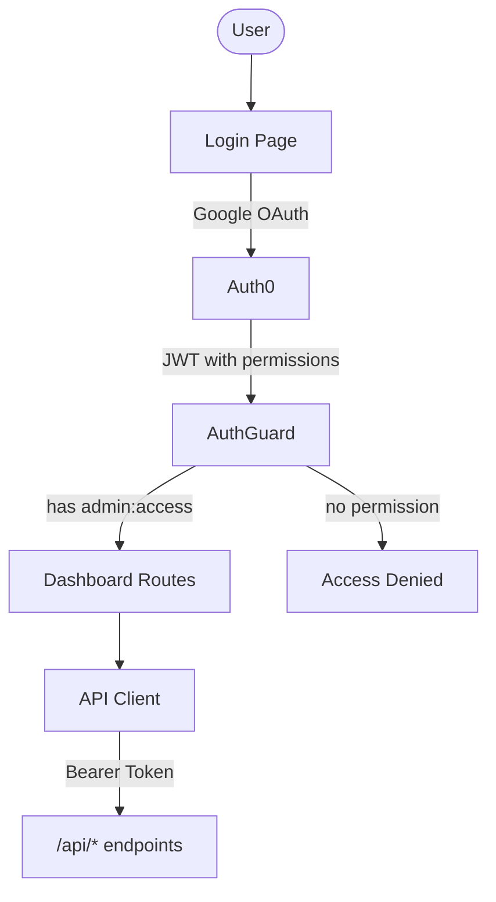

# Dashboard

Dashboard for queue monitoring and configuration. Served by the webhook server at `/admin`.

## Stack

Vite, React 19, React Router (HashRouter), TanStack Query, Tailwind CSS

## Authentication

Auth0 with Google OAuth. Requires `admin:access` permission.

## Routing

Hash-based routing for deep linking. The hash is never sent to the server, so the webhook server serves static files without SPA fallback.

## Pages

Page URLs should follow the format of existing pages.

- `#/` — Home: navigation to other pages
- `#/tasks` — Tasks list with status filtering
- `#/tasks/:id` — Task details with retry/remove
- `#/new-task` — Create admin task with custom instruction
- `#/sessions` — Active Claude Code sessions with stats and cleanup
- `#/settings` — Bot name configuration

## Development

Dashboard container runs `vite build --watch`. Output goes to shared Docker volume mounted by webhook.

## Components

When building pages and components. Try and reuse existing components in the `components/` folder within reason. If an existing component doesn't fit, try and create a new reusable components, but do not overload components with too many props. Sometimes it's ok for custom components to be single-use only.

## Styling

- Page titles include an icon
- Content sections use the `glass-card` class
- Use existing button classes (`btn-primary`, `btn-danger`) and accent colors
- Reference existing pages (Settings, Jobs) for patterns
